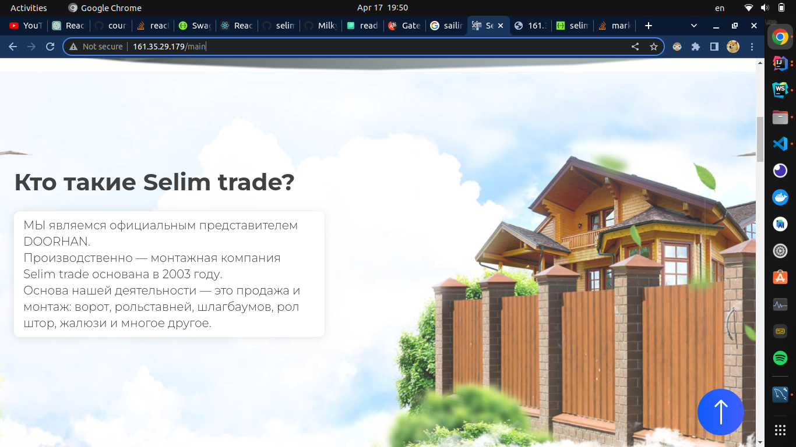
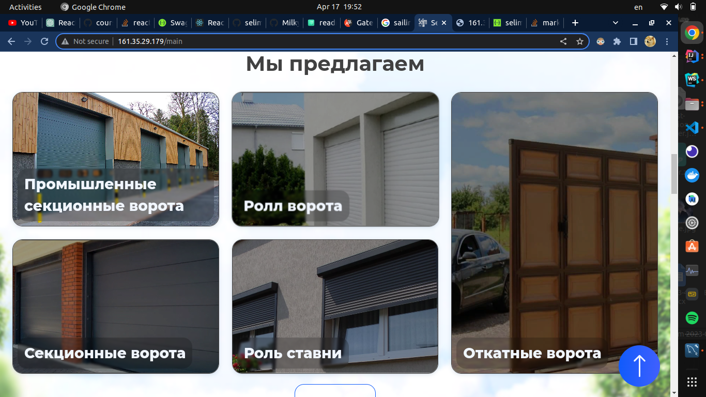
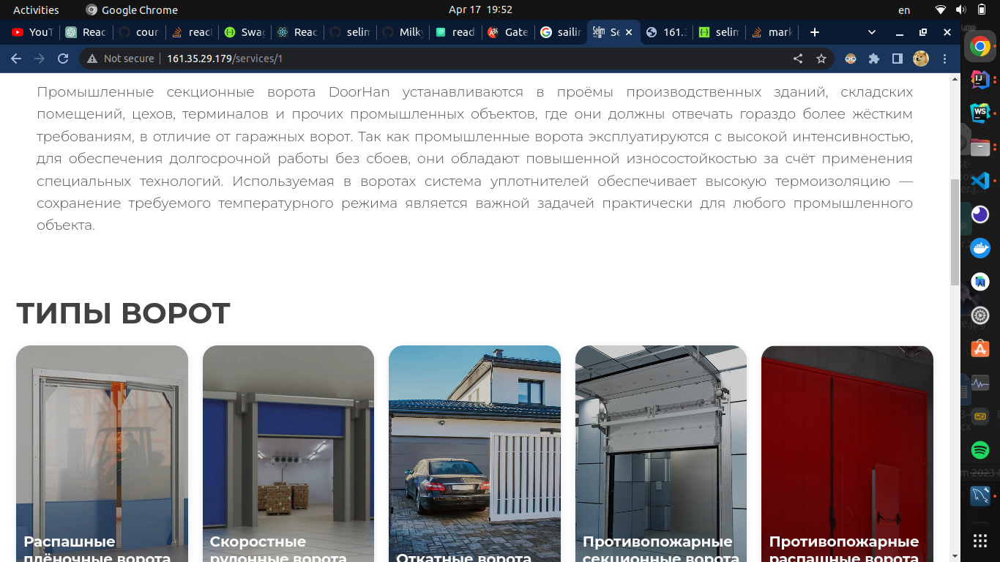

# Backend for Gate sales website. 

## Screenshots

## Documentation backend

[Swagger](https://app.swaggerhub.com/apis/tarantulDeveloper/selim-api/1.0)

## Frontend (may not be available)

[selim_trade](http://161.35.29.179/main)

## Authors

- [@Bekzhan Satiev](https://www.github.com/tarantulDeveloper)

## Stack

Postgresql, Spring Boot 3, Ubuntu Server

